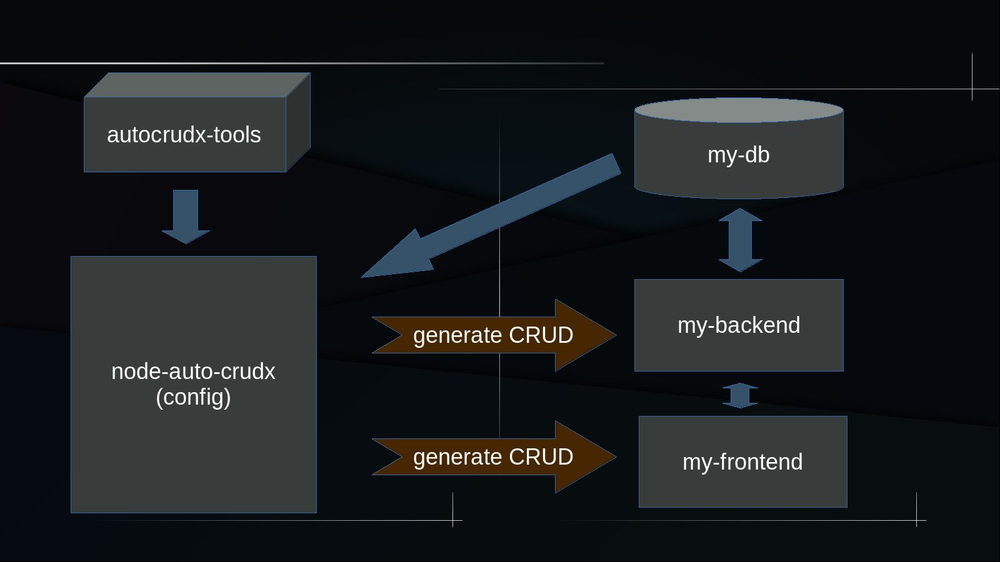

# Comenzar

## ¿ Qué es un CRUD ?

En informática, [CRUD](https://en.wikipedia.org/wiki/Create,_read,_update_and_delete) es el acrónimo de _"Crear"_, _"Leer"_, _"Actualizar"_ y _"Borrar"_, (del original en inglés, _Create, Read, Update and Delete_), que se usa para referirse a las funciones básicas en bases de datos o la capa de persistencia en un software.

:::info Ejemplos

Los siguientes ejemplos de **CRUDs** son creados a travéz de la herramienta ***Auto-CRUDx*** que está desarrollada en [Node](https://nodejs.org/). Pero su **_stack_**, tanto del _backend_ como del _frontend_, es generado para [Laravel](https://laravel.com/) y [Vue](https://vuejs.org/) respectivamente.
:::

## 1° CRUD Básico (ejemplo)

El siguiente video muestra ejemplos de CRUDs para tablas simples que generalmente se usan para llenar listas desplegable como elementos `select` de HTML.

<video controls>
  <source src="./assets/get-start-1.mp4">
</video>

## 2° CRUD Intermedio (ejemplo)

Los CRUDs intermedios son aquellos un poco más elaborados, los cuales generalmente tratan sobre un formulario que contiene varios campos de distintos tipos. Como el que muestra el siguiente video.

<video controls>
  <source src="./assets/get-start-2.mp4">
</video>

## 3° CRUD Avanzado (ejemplo)

Los CRUDs avanzados son los más complejos, porque generalmente están constituidos por múltiples formularios. Específicamente, un formulario para una tabla maestra y **_N_** formularios para **_N_** tablas detalles. Como el que muestra el siguiente video.

<video controls>
  <source src="./assets/get-start-3.mp4">
</video>

:::tip Información
Usted puede consultar el código generado, tanto del [Backend](https://github.com/CaribesTIC/laravuel-api/tree/main/Modules/Meeting) como del [Frontend](https://github.com/CaribesTIC/laravuel-spa/tree/main/src/modules/Meeting), de ejemplos anteriores. 
:::

## ¿ Por qué Auto-CRUDx ?

Las funciones básicas en bases de datos o la capa de persistencia en un software son tareas repetitivas que se hacen regularmente cuando de desarrollo de software se trata. Por lo que, una vez definida una estructura estandar, para los típicos CRUDs, es útil una herramienta que los genere automáticamente.

## ¿ Qué es Auto-CRUDx ?

:::tip Importante
[Auto-CRUDx](https://github.com/ecanquiz/node-auto-crudx) brinda las herramientas para ayudarlo a crear su propio Generador de CRUDs Automático (según su propio **_stack_** de desarrollp y arquitectura particular). Por lo tanto, usted mismo debe diseñar sus plantillas según su criterio.
:::

:::warning Advertencia
***Auto-CRUDx*** no es un Generador de CRUDs por si mismo, más bien, es una herramienta que le facilitará a usted la construcción de su **Generador de CRUDs**. En otras palabras, ***Auto-CRUDx*** le ayudará a construir el suyo propio.

***Auto-CRUDx*** tampoco es una herramienta para construir _Scaffolds_. Por lo tanto, no genera _Layout_, _Sign In_, _Sign Up_, _Password Recovery_, etc. 
:::

Tenga en cuenta que el proyecto `node-auto-crudx` usa como dependencia el paquete `autocrudx-tools`.

El proyecto `node-auto-crudx` leera su base de datos y escribirá el código generado aparte en su proyecto. El anterior diagrama muestra un **_stack_** orientado a micro-servicios, no obstante, funciona igual si se tratara de un **_stack_** MVC.

## Requisitos

Auto-CRUDx está desarrollado en [Node](https://nodejs.org/), por lo que es importante tener conocimientos mínimos del mismo y tenerlo instalado en su maquina.

Además, usa como dependencia las Plantillas de JavaScript Integradas [EJS](https://www.npmjs.com/package/ejs). Por lo que también es fundamental leer la respectiva [documentación](https://ejs.co/).

:::warning Advertencia
La actual versión del **Auto-CRUx**, solo se alimenta de la información proveniente del diseño de sus tablas creadas en su bases de datos [PostgreSQL](https://www.postgresql.org/). Por lo que debe tener previamente instalado PostgreSQL en su máquina, así como también haber construido sus correspondientes tablas en dicha base de datos.
:::

